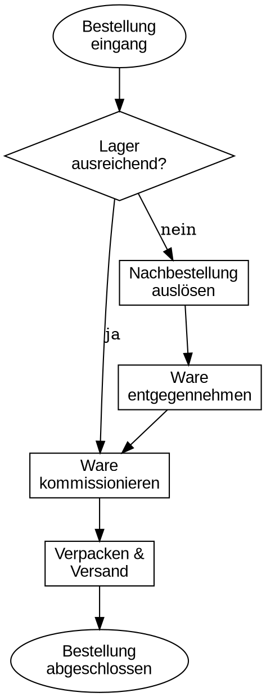
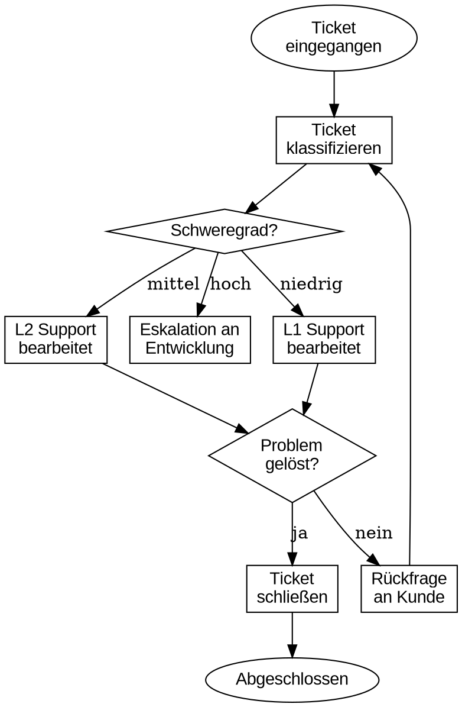
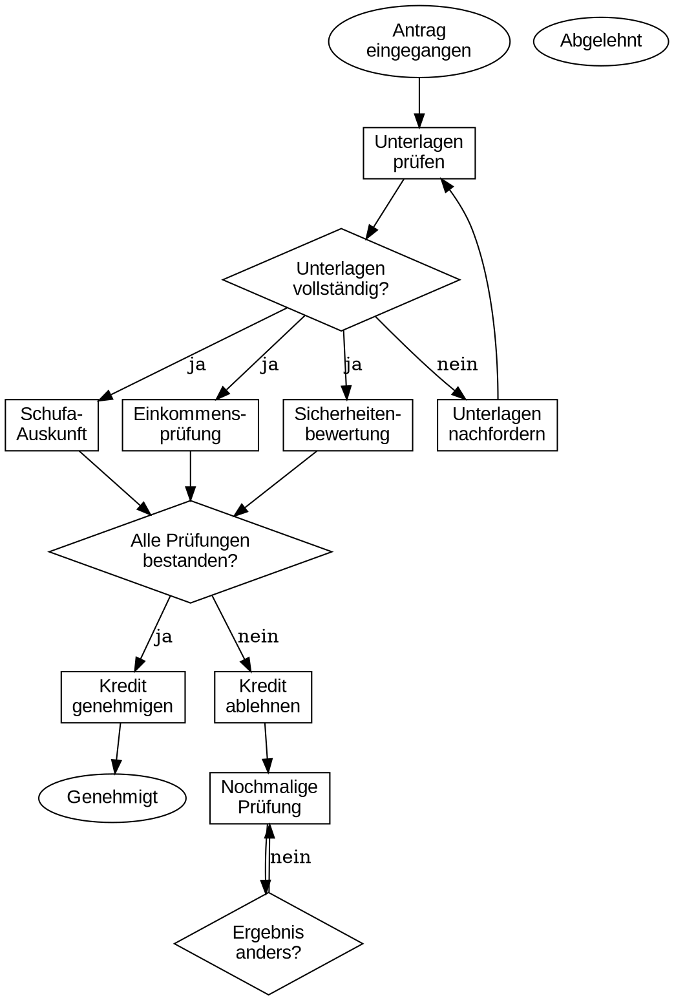

# DOT Translation Study — Implementation Plan

> **For Claude:** REQUIRED SUB-SKILL: Use superpowers:executing-plans to implement this plan task-by-task.

**Goal:** Systematisch testen, ob GraphViz DOT als Zwischenformat für Business-Diagramme taugt — Übersetzungsqualität und Analysefähigkeit.

**Architecture:** Ground Truth First — DOT-Dateien als Quelle, daraus Bilder + XML generieren, dann LLM-Rückübersetzung + Analyse bewerten. Python-Script für automatisierten Graph-Diff.

**Tech Stack:** GraphViz (dot CLI), Python 3.13 + pydot, draw.io XML (manuell), BPMN 2.0 XML (manuell)

**Design Doc:** `docs/plans/2026-02-14-dot-translation-study-design.md`

---

### Task 1: Dependencies installieren

**Step 1: GraphViz installieren**

Run: `brew install graphviz`
Expected: `dot - graphviz version X.Y.Z` verfügbar

**Step 2: Python-Dependencies installieren**

Run: `pip install pydot`
Expected: pydot importierbar

**Step 3: Verify**

Run: `dot -V && python3 -c "import pydot; print('ok')"`
Expected: Versionsnummer + "ok"

**Step 4: Commit**

```bash
# Kein Commit nötig — nur System-Dependencies
```

---

### Task 2: Prompts schreiben

**Files:**
- Create: `prompts/translate_image.md`
- Create: `prompts/translate_xml.md`
- Create: `prompts/analyze_process.md`

**Step 1: translate_image.md**

```markdown
Du erhältst ein Diagramm als Bild. Übersetze es in GraphViz DOT-Syntax.

Regeln:
- Jeden sichtbaren Knoten als Node, jede Verbindung als Edge
- Subgraphs/Cluster für visuelle Gruppierungen (Lanes, Pools, Abteilungen)
- Semantische Shapes: diamond=Entscheidung, box=Aktivität, ellipse=Start/End, octagon=Fehler/Warnung
- Labels exakt vom Bild übernehmen, nicht umformulieren
- Edge-Labels (Beschriftungen an Pfeilen) übernehmen
- Pfeilrichtung aus dem Bild ableiten
- Nur valides DOT ausgeben, keine Erklärung, kein Markdown-Codeblock
```

**Step 2: translate_xml.md**

```markdown
Du erhältst ein Prozessdiagramm als XML (BPMN 2.0 oder draw.io Format). Übersetze die Struktur in GraphViz DOT-Syntax.

Regeln:
- Ignoriere Layout-Metadaten (Koordinaten, Größen, Farben, Positionen)
- Extrahiere nur Topologie: Knoten, Kanten, Gruppierungen
- Subgraphs/Cluster für Pools, Lanes, Gruppierungen
- Semantische Shapes: diamond=Entscheidung/Gateway, box=Aktivität/Task, ellipse=Start/End Event
- Labels exakt aus dem XML übernehmen
- Pfeilrichtung aus sequenceFlow/Verbindungen ableiten
- Nur valides DOT ausgeben, keine Erklärung, kein Markdown-Codeblock
```

**Step 3: analyze_process.md**

```markdown
Du erhältst einen Geschäftsprozess als GraphViz DOT. Analysiere ihn auf:

1. **Strukturelle Probleme:**
   - Dead Ends (Knoten ohne ausgehende Kante, die kein End-Knoten sind)
   - Endlosschleifen (Zyklen ohne Exit-Bedingung)
   - Fehlende Pfade (Entscheidungen mit weniger Ausgängen als erwartet)
   - Unerreichbare Knoten

2. **Organisatorische Probleme:**
   - Bottlenecks (ein Knoten/Akteur, durch den zu viele Pfade laufen)
   - Unklare Verantwortlichkeiten (Lanes/Cluster ohne Aktivitäten)
   - Überlastung (zu viele Direct Reports, zu viele Aufgaben in einer Lane)

3. **Effizienz-Probleme:**
   - Unnötige Schleifen
   - Ping-Pong (Aufgaben die mehrfach zwischen Akteuren hin- und herwandern)
   - Redundante Schritte

Benenne jedes gefundene Problem konkret mit Bezug auf die Node-Labels aus dem DOT.
Wenn keine Probleme gefunden: explizit sagen "Keine Probleme identifiziert".
```

**Step 4: Commit**

```bash
git add prompts/
git commit -m "feat: add standardized prompts for translation and analysis"
```

---

### Task 3: Ground Truth — Flowcharts

**Files:**
- Create: `testdata/flowchart/01_simple/ground_truth.dot`
- Create: `testdata/flowchart/02_medium/ground_truth.dot`
- Create: `testdata/flowchart/02_medium/expected_findings.md`
- Create: `testdata/flowchart/03_complex/ground_truth.dot`
- Create: `testdata/flowchart/03_complex/expected_findings.md`

**Step 1: 01_simple — Kundenbestellung**



**Step 2: 02_medium — Support-Ticket mit Dead End**



**Step 3: expected_findings.md für 02_medium**

```markdown
# Expected Findings — Support-Ticket (02_medium)

## Seeded Defect
- **Typ:** Dead End
- **Location:** Node "Eskalation an Entwicklung" (escalate)
- **Beschreibung:** Der Knoten "escalate" hat keine ausgehende Kante. Tickets mit Schweregrad "hoch" werden eskaliert, aber der Prozess endet dort ohne Auflösung.
- **Erwartete Erkennung:** LLM sollte identifizieren, dass "escalate" ein Dead End ist — kein Pfad zurück zum Hauptflow oder zu einem End-Knoten.
```

**Step 4: 03_complex — Kreditantrag mit Endlosschleife**



**Step 5: expected_findings.md für 03_complex**

```markdown
# Expected Findings — Kreditantrag (03_complex)

## Seeded Defect
- **Typ:** Endlosschleife
- **Location:** Nodes "review" → "review_check" → "review"
- **Beschreibung:** Nach Ablehnung wird der Antrag nochmal geprüft (review). Der Entscheidungsknoten "review_check" hat nur einen Ausgang ("nein" → zurück zu review). Es gibt keinen "ja"-Pfad, der die Schleife verlässt. Der Prozess bleibt ewig in dieser Schleife gefangen.
- **Erwartete Erkennung:** LLM sollte die Endlosschleife identifizieren und das Fehlen eines Exit-Pfads aus "review_check" benennen.

## Sekundärer Befund (optional)
- Node "done_no" (Abgelehnt) ist unerreichbar — kein Pfad führt dorthin, da "reject" direkt zu "review" geht statt zu "done_no".
```

**Step 6: PNGs rendern**

```bash
for dir in testdata/flowchart/*/; do
    dot -Tpng "$dir/ground_truth.dot" -o "$dir/rendered.png"
done
```

**Step 7: draw.io XML erzeugen**

Für jeden Flowchart-Case eine draw.io-kompatible XML-Datei als `source.xml` erstellen. Die XML muss die gleiche Topologie wie das DOT abbilden, aber im draw.io-Format (mxGraphModel mit mxCell-Elementen inkl. Koordinaten).

**Step 8: Commit**

```bash
git add testdata/flowchart/
git commit -m "feat: add flowchart ground truth (3 cases, 2 with seeded defects)"
```

---

### Task 4: Ground Truth — BPMN

**Files:**
- Create: `testdata/bpmn/01_simple/ground_truth.dot`
- Create: `testdata/bpmn/02_medium/ground_truth.dot` + `expected_findings.md`
- Create: `testdata/bpmn/03_complex/ground_truth.dot` + `expected_findings.md`

**Step 1: 01_simple — Urlaubsantrag (3 Lanes)**

DOT mit 3 `subgraph cluster_*` (Mitarbeiter, Vorgesetzter, HR). Linearer Flow: Antrag stellen → Prüfen → Genehmigen → Im System eintragen. Start/End als ellipse, Tasks als box, Genehmigung als diamond.

**Step 2: 02_medium — Rechnungsfreigabe**

DOT mit XOR-Gateway (`shape=diamond, label="XOR\nBetrag < 1000?"`) und Parallel-Gateway. **Defekt:** XOR hat nur einen Ausgang (Auto-Freigabe), der "manuell prüfen"-Pfad fehlt.

Expected Finding: XOR-Gateway mit nur einem Ausgang.

**Step 3: 03_complex — Onboarding**

DOT mit 3 parallelen Subgraphs (IT, HR, Fachbereich). **Defekt:** Alle 3 Pfade müssen durch einen einzelnen Knoten "Teamlead-Freigabe" — offensichtlicher Bottleneck.

Expected Finding: Bottleneck bei "Teamlead-Freigabe".

**Step 4: PNGs rendern + BPMN 2.0 XML erzeugen**

BPMN XML mit `<definitions>`, `<process>`, `<startEvent>`, `<task>`, `<exclusiveGateway>`, `<sequenceFlow>` etc. Layout-Daten (`<bpmndi:BPMNDiagram>`) hinzufügen, damit es realistisch wirkt.

**Step 5: Commit**

```bash
git add testdata/bpmn/
git commit -m "feat: add BPMN ground truth (3 cases, 2 with seeded defects)"
```

---

### Task 5: Ground Truth — Orgcharts

**Files:**
- Create: `testdata/orgchart/01_simple/ground_truth.dot`
- Create: `testdata/orgchart/02_medium/ground_truth.dot` + `expected_findings.md`
- Create: `testdata/orgchart/03_complex/ground_truth.dot` + `expected_findings.md`

**Step 1: 01_simple — Kleine Firma**

Hierarchischer Graph (`rankdir=TB`): GF → 3 Abteilungsleiter → je 2 Mitarbeiter. Einfache Baumstruktur, 9 Knoten.

**Step 2: 02_medium — Matrixorganisation**

Doppel-Reporting mit `style=dashed` für fachliche Linien. **Defekt:** Ein Manager hat 12 Direct Reports (überlastete Span of Control).

Expected Finding: Span of Control Problem.

**Step 3: 03_complex — Konzernstruktur**

Holding + 3 Tochtergesellschaften als Subgraphs. **Defekt:** Eine Tochter hat keine Reporting-Linie zur Holding — verwaiste Einheit.

Expected Finding: Verwaiste Organisationseinheit.

**Step 4: PNGs rendern** (kein XML — Orgchart hat kein Standard-XML-Format)

**Step 5: Commit**

```bash
git add testdata/orgchart/
git commit -m "feat: add orgchart ground truth (3 cases, 2 with seeded defects)"
```

---

### Task 6: Ground Truth — Swimlanes

**Files:**
- Create: `testdata/swimlane/01_simple/ground_truth.dot`
- Create: `testdata/swimlane/02_medium/ground_truth.dot` + `expected_findings.md`
- Create: `testdata/swimlane/03_complex/ground_truth.dot` + `expected_findings.md`

**Step 1: 01_simple — Bestellprozess (3 Lanes)**

3 `subgraph cluster_*` (Kunde, Vertrieb, Lager) mit `rank=same` für horizontale Ausrichtung innerhalb Lanes.

**Step 2: 02_medium — Softwarerelease**

4 Lanes (Dev, QA, Ops, Management). **Defekt:** Bug-Ping-Pong — Aufgabe wird 4x zwischen Dev und QA verschoben.

Expected Finding: Ineffizienter Ping-Pong zwischen Dev und QA.

**Step 3: 03_complex — Reklamation**

4 Lanes (Kunde, Service, Technik, Recht). **Defekt:** Lane "Recht" existiert als Cluster, hat aber keine einzige Aktivität.

Expected Finding: Leere Lane ohne Verantwortlichkeit.

**Step 4: PNGs rendern + draw.io XML erzeugen**

**Step 5: Commit**

```bash
git add testdata/swimlane/
git commit -m "feat: add swimlane ground truth (3 cases, 2 with seeded defects)"
```

---

### Task 7: compare.py — Graph-Diff Tool

**Files:**
- Create: `eval/compare.py`
- Create: `eval/test_compare.py`

**Step 1: Failing Test schreiben**

```python
# eval/test_compare.py
import pytest
from compare import parse_dot, compare_graphs

def test_identical_graphs():
    dot = 'digraph { a -> b; b -> c; }'
    result = compare_graphs(dot, dot)
    assert result["node_recall"] == 1.0
    assert result["node_precision"] == 1.0
    assert result["edge_recall"] == 1.0
    assert result["edge_precision"] == 1.0

def test_missing_node():
    truth = 'digraph { a -> b; b -> c; }'
    candidate = 'digraph { a -> b; }'
    result = compare_graphs(truth, candidate)
    assert result["node_recall"] < 1.0  # c fehlt
    assert result["edge_recall"] < 1.0  # b->c fehlt

def test_extra_node():
    truth = 'digraph { a -> b; }'
    candidate = 'digraph { a -> b; b -> c; }'
    result = compare_graphs(truth, candidate)
    assert result["node_recall"] == 1.0   # alle truth-nodes gefunden
    assert result["node_precision"] < 1.0  # extra node c

def test_subgraph_match():
    truth = 'digraph { subgraph cluster_a { x; y; } subgraph cluster_b { z; } }'
    candidate = 'digraph { subgraph cluster_a { x; y; } z; }'
    result = compare_graphs(truth, candidate)
    assert result["subgraph_match"] == 0.5  # 1 von 2 Clustern
```

**Step 2: Run tests, verify failure**

Run: `cd eval && python3 -m pytest test_compare.py -v`
Expected: FAIL — compare module doesn't exist

**Step 3: Implement compare.py**

```python
# eval/compare.py
"""Graph-Diff: Vergleicht Ground Truth DOT mit LLM-generiertem DOT."""
import pydot
import sys
from pathlib import Path

def parse_dot(dot_string: str) -> pydot.Dot:
    graphs = pydot.graph_from_dot_data(dot_string)
    return graphs[0]

def extract_nodes(graph: pydot.Dot) -> set[str]:
    nodes = set()
    for node in graph.get_nodes():
        name = node.get_name().strip('"')
        if name not in ('node', 'edge', 'graph', '\\n', ''):
            nodes.add(name)
    for subgraph in graph.get_subgraphs():
        nodes.update(extract_nodes(subgraph))
    return nodes

def extract_edges(graph: pydot.Dot) -> set[tuple[str, str]]:
    edges = set()
    for edge in graph.get_edges():
        src = edge.get_source().strip('"')
        dst = edge.get_destination().strip('"')
        edges.add((src, dst))
    for subgraph in graph.get_subgraphs():
        edges.update(extract_edges(subgraph))
    return edges

def extract_subgraphs(graph: pydot.Dot) -> dict[str, set[str]]:
    clusters = {}
    for sg in graph.get_subgraphs():
        name = sg.get_name().strip('"')
        if name.startswith('cluster'):
            clusters[name] = extract_nodes(sg)
    return clusters

def precision_recall(truth: set, candidate: set) -> tuple[float, float]:
    if not truth and not candidate:
        return 1.0, 1.0
    recall = len(truth & candidate) / len(truth) if truth else 1.0
    precision = len(truth & candidate) / len(candidate) if candidate else 1.0
    return precision, recall

def compare_graphs(truth_dot: str, candidate_dot: str) -> dict:
    truth = parse_dot(truth_dot)
    candidate = parse_dot(candidate_dot)

    truth_nodes = extract_nodes(truth)
    cand_nodes = extract_nodes(candidate)
    node_prec, node_rec = precision_recall(truth_nodes, cand_nodes)

    truth_edges = extract_edges(truth)
    cand_edges = extract_edges(candidate)
    edge_prec, edge_rec = precision_recall(truth_edges, cand_edges)

    truth_sg = extract_subgraphs(truth)
    cand_sg = extract_subgraphs(candidate)
    if truth_sg:
        matched = sum(1 for k, v in truth_sg.items()
                      if k in cand_sg and v == cand_sg[k])
        sg_match = matched / len(truth_sg)
    else:
        sg_match = 1.0

    return {
        "node_precision": round(node_prec, 3),
        "node_recall": round(node_rec, 3),
        "edge_precision": round(edge_prec, 3),
        "edge_recall": round(edge_rec, 3),
        "subgraph_match": round(sg_match, 3),
        "truth_nodes": len(truth_nodes),
        "candidate_nodes": len(cand_nodes),
        "truth_edges": len(truth_edges),
        "candidate_edges": len(cand_edges),
    }

if __name__ == "__main__":
    if len(sys.argv) != 3:
        print("Usage: python compare.py <ground_truth.dot> <candidate.dot>")
        sys.exit(1)
    truth = Path(sys.argv[1]).read_text()
    candidate = Path(sys.argv[2]).read_text()
    result = compare_graphs(truth, candidate)
    for k, v in result.items():
        print(f"  {k}: {v}")
```

**Step 4: Run tests, verify pass**

Run: `cd eval && python3 -m pytest test_compare.py -v`
Expected: 4 PASS

**Step 5: Commit**

```bash
git add eval/
git commit -m "feat: add graph comparison tool with tests"
```

---

### Task 8: Phase 2 — Übersetzungen durchführen

**Für jeden der 12 Cases (21 Übersetzungen total):**

Jede Übersetzung wird als **eigenständiger Subagent** mit frischem Kontext ausgeführt:
1. Subagent bekommt `rendered.png` + `prompts/translate_image.md` → schreibt `from_image.dot`
2. Subagent bekommt `source.xml` + `prompts/translate_xml.md` → schreibt `from_xml.dot` (wo vorhanden)

**Parallelisierung:** Alle 4 Diagrammtypen können parallel laufen. Innerhalb eines Typs sequentiell (01 → 02 → 03).

**Nach allen Übersetzungen: Commit pro Typ**

```bash
git add testdata/flowchart/*/from_*.dot
git commit -m "feat: add LLM translations for flowcharts"
# analog für bpmn, orgchart, swimlane
```

---

### Task 9: Phase 3 — Analysen durchführen

**Für die 8 Cases mit Seeded Defects:**

Subagent bekommt `from_image.dot` + `prompts/analyze_process.md` → schreibt `analysis_from_image.md`
Subagent bekommt `from_xml.dot` + `prompts/analyze_process.md` → schreibt `analysis_from_xml.md` (wo vorhanden)

**Total: ~14 Analysen** (8 × Bild-Pfad + 6 × XML-Pfad, Orgchart hat kein XML)

**Commit:**

```bash
git add testdata/*/0{2,3}_*/analysis_*.md
git commit -m "feat: add process analyses for defect cases"
```

---

### Task 10: Phase 4 — Evaluation

**Files:**
- Create: `eval/summary.md`
- Create: `testdata/<type>/<case>/eval.md` (12 Dateien)

**Step 1: compare.py über alle Cases laufen lassen**

```bash
for type in flowchart bpmn orgchart swimlane; do
    for case in testdata/$type/*/; do
        echo "=== $case ==="
        python3 eval/compare.py "$case/ground_truth.dot" "$case/from_image.dot"
        if [ -f "$case/from_xml.dot" ]; then
            python3 eval/compare.py "$case/ground_truth.dot" "$case/from_xml.dot"
        fi
    done
done
```

**Step 2: Ergebnis-Matrix in eval/summary.md schreiben**

Enthält:
- Tabelle: Typ × Input-Format → Avg Recall/Precision
- Detection Rate pro Defekt-Case
- Gesamtfazit
- Bekannte Limitierungen

**Step 3: Commit**

```bash
git add eval/summary.md testdata/*/*/eval.md
git commit -m "feat: add evaluation results and summary"
```

---

### Task 11: Phase 5 — Marvins Validierung

**Kein Automations-Task — Marvin prüft manuell:**

1. Ausreißer anschauen (Cases mit niedrigen Scores)
2. Semantic Fidelity bewerten (1-5) für auffällige Cases
3. Analyse-Ergebnisse gegen Expected Findings prüfen
4. Fazit und nächste Schritte formulieren

---
